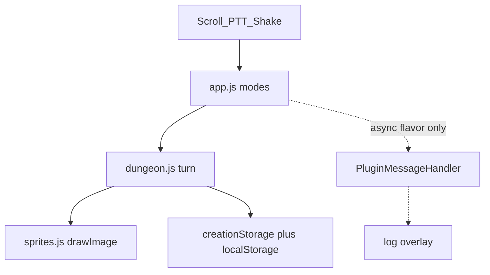

# Pocket Dungeon

A new Creation at [`dungeon/`](dungeon/) — sibling of [`familiar/`](familiar/), never inside [`creations-sdk-main/`](creations-sdk-main/). Distinct from Familiar: no care meters, no pet, permadeath runs, turn-based bump combat.

## Exacting Resolver — inventory and verdicts

**Familiar artifact we are borrowing from (technique only):** [`familiar/js/app.js`](familiar/js/app.js) `PALETTES` (letter → hex), `SPRITES` (string-row matrices, `.` transparent), `renderPixelSprite()` (`fillRect` 1×1), 2-frame idle loop, `creationStorage.plain` Base64 + `localStorage` fallback, `SIDE_CLICK_DEBOUNCE_MS = 120`, accel shake threshold, defensive LLM JSON parse.

**What we will not copy:** pet species/evolution, emoji particles, Familiar’s ~3000-line monolith, per-frame string walks for a full map.

### Crucible 1 — Room presentation vs tiny screen

- **Failure if guessed:** A full-floor grid at 16px is unreadable on the physical R1; a card-only “choose a door” game is not a dungeon.
- **Option A:** 7×5 tiles at 32px with a dedicated HUD stack (walkable 5×3). Pros: HUD never overlaps. Cons: rooms are closets.
- **Option B:** 7×7 tiles at 32px (`224×224` canvas), HUD overlaid on the stage like Familiar’s name/speech. Walkable 5×5 after a 1-tile wall ring. Pros: real rooms, sprites stay Familiar-sized. Cons: log must be short.
- **Verdict: B.** One room on screen, doors on the ring, next room on step-through. Floor = 5–8 rooms, not one giant map.

### Crucible 2 — Sprite rasterizer vs map cost

- **Failure:** Familiar re-parses ASCII every blink for *one* 32×32 pet. A 49-tile room at that cost will hitch on-device.
- **Option A:** Call `fillRect` per pixel per tile every render (Familiar copied).
- **Option B:** Same ASCII + palette authoring; **bake** each unique `(matrix, palette)` to an offscreen canvas once; `drawImage` per tile. 2-frame actors swap baked canvases.
- **Verdict: B.** Same art language, different runtime. Scale: 16-wide matrices drawn at 2× so each glyph is 32px on the map (Familiar authors ~20–26-wide strings; tiles/actors stay 16×16 source).

### Crucible 3 — LLM in the turn loop

- **Failure:** Blocking a move on `PluginMessageHandler` makes the game feel broken when rabbitOS is slow or desktop has no bridge.
- **Option A:** LLM generates room JSON as you enter.
- **Option B:** Seeded local procgen owns geometry, enemies, loot, HP. LLM is async garnish only: a flavor line on room enter and a death epitaph. No interactive “ask the dungeon” input in v1 — long press is already reserved for the pack (the R1 side button *is* the PTT button, so `sideClick` and `longPressStart` are the same hardware; each gesture gets exactly one job). Game never waits. Timeout + parse failure → canned line.
- **Verdict: B.** Mirror weather/Familiar: LLM is fallback personality, not the simulation.

### Crucible 4 — Module split vs Familiar monolith

- **Failure:** One `app.js` with matrices + BSP + combat + LLM will be unreviewable and will mix render with mutation.
- **Option A:** Single file like [`dice/js/app.js`](dice/js/app.js).
- **Option B:** Three static scripts, no bundler, no shared repo package (AGENTS.md: don’t share runtime across apps).
- **Verdict: B.** Load order in [`dungeon/index.html`](dungeon/index.html): `sprites.js` → `dungeon.js` → `app.js`.

### Crucible 5 — Controls (scroll is not a D-pad)

- **Failure:** Mapping scroll to “move north” fights the hardware (one axis, discrete ticks).
- **Option A:** Scroll cycles facing `N/E/S/W`; side click steps / bump-attacks; long press opens inventory.
- **Option B:** Scroll cycles highlighted adjacent tiles; click walks there.
- **Verdict: A.** Facing is always visible (compass on the action button + arrow on hero). Shake (accel, Familiar’s `mag > 0.85` + 700ms cooldown) = **wait**: skip your step, enemies still act, unlimited uses — self-balancing because waiting feeds free enemy hits, and it doubles as a stall for regen-free caution. Desktop: arrows/WASD change facing, Enter/click = act, Esc = inventory.

---

## Layout (240×282)

```
header overlay     floor · HP · gold
224×224 canvas     7×7 × 32px tiles, pixelated
2-line log overlay bottom of canvas
hint bar           scroll: face · side: go · hold: pack
```

Modes: `title` → `class` → `play` | `inventory` | `dead` | `win`.

---

## Sprite pipeline (reuse Familiar’s *generator*, new art)

Letter keys stay Familiar’s: `O` outline, `C` body, `S` shade, `H` highlight, `W` white, `B` black, `P` accent, `R` mouth/blood, `K` gold, `Y` light. `.` skip.

Palettes (new, not bunny/drake): `knight`, `scout`, `mage` for the hero; `beast`, `undead`, `boss` for enemies; `dungeon` for tiles/items.

**Must-author matrices (16×16, two idle frames for actors):**

- Tiles: `floor`, `wall`, `door`, `stairs`, `chest`, `trap`
- Hero: one body, three palettes
- Enemies: `slime`, `bat`, `skeleton`, `ogre` (boss)
- Items (drawn in inventory row): `potion`, `blade`, `mail`, `coin`

`bakeAll()` runs once at boot. `drawRoom(ctx, roomState, frame)` only `drawImage`s. `image-rendering: pixelated` on the canvas (same as [`.pet-canvas`](familiar/css/styles.css)).

Do **not** import Familiar’s `SPRITES` object.

---

## Game simulation ([`dungeon/js/dungeon.js`](dungeon/js/dungeon.js))

Seeded RNG from `crypto.getRandomValues` with the same stub-detection idea as [`dice/js/app.js`](dice/js/app.js) `cryptoUint32`, then a mulberry32 (or equivalent) stream from `run.seed` so floors are deterministic and save/resume matches.

**Run:** class, seed, floor (1–8), gold, HP/max, ATK/DEF, pack (max 5), current room id, room graph.

**Floor:** 5–8 rooms as a planar graph (start room, 1–2 extra branches, one stairs room). Each room: 7×7 grid, wall border, 1–2 door cells pointing at neighbors, 0–2 enemies, optional chest/trap. **Enemies** (HP/ATK, DEF 0 unless noted): `slime` 4/2, `bat` 3/3, `skeleton` 6/3, `ogre` (boss, floor 8 only) 20/5 DEF 1; scale HP +1 per floor above their debut (slime f1, bat f2, skeleton f4). **Win:** the floor-8 ogre guards the stairs room; stepping on the stairs after the ogre is dead = `win`, before = log "THE OGRE BARS THE WAY" and refuse the step.

**Turn:** player act → resolve bump (move or melee) → traps on land → enemy step (simple chase if Manhattan ≤ 4, else idle) → check HP. No diagonal. Doors: step onto door tile loads neighbor room, hero placed on the opposite door.

**Combat:** integer HP; hit = `max(1, ATK - DEF)` + 0–1 roll from seeded RNG. Log one short line per event (`HIT SLIME 3`, `TRAP 2`, `DEAD`). Traps deal 2 HP when stepped on, then arm off (one-shot per room generation).

**Pack (max 5, distinct items stack as separate slots):** `potion` = +6 HP clamped to max, `blade` = +1 ATK permanently on use, `mail` = +1 DEF permanently on use, `coin` = +10 gold instantly on pickup (never occupies a pack slot). Using an item from inventory consumes that turn (enemies act). Pack full + chest: chest stays closed and re-loggable.

**Class kits:** Knight HP 20 ATK 4 DEF 2; Scout HP 16 ATK 3 DEF 1 (optional: facing-step into empty = 2 tiles once we prove 1-tile is solid — do not ship double-step in phase 1); Mage HP 14 ATK 5 DEF 0.

**Death:** permadeath. Persist `bestFloor`, last 8 epitaphs. Mid-run snapshot so closing the WebView resumes; death clears `run` and keeps meta.

Snapshot version field `v: 1`, validate like Familiar `applySnapshot` (clamp numbers, drop unknown item ids).

---

## SDK wiring ([`dungeon/js/app.js`](dungeon/js/app.js))

| Input | Play | Inventory | Title/class |
| --- | --- | --- | --- |
| scroll | cycle facing | cycle slot | cycle class / start |
| side click (debounced 120ms) | step/attack | use / close empty | confirm |
| long press | open pack (or close) | close | — |
| shake | wait | — | — |

LLM contract: prompt for **JSON only** `{"line":"..."}` (≤80 chars). Reuse Familiar’s `stripMarkdownFences`, `LLM_TIMEOUT_MS = 20000`, and parse of both `data.data` and `data.message`. `wantsJournalEntry: true` only on death epitaph. Desktop: no handler → canned lines, never throw.

Tiny Web Audio `chirp` for hit/step (same pattern as Familiar) — not a synth. Feature-detect; respect `prefers-reduced-motion` by skipping canvas idle swap if set.

`closeWebView` not required; optional on title “quit” later.

---

## Files to add / touch

New:

- [`dungeon/index.html`](dungeon/index.html) — 240 viewport, canvas 224×224, log, hint, action label
- [`dungeon/css/styles.css`](dungeon/css/styles.css) — dark stone tokens, overlay HUD, pixelated canvas, 44px title hit target
- [`dungeon/js/sprites.js`](dungeon/js/sprites.js) — palettes, matrices, bake, blit
- [`dungeon/js/dungeon.js`](dungeon/js/dungeon.js) — RNG, gen, turns, snapshot
- [`dungeon/js/app.js`](dungeon/js/app.js) — modes, input, LLM, persist, render
- [`dungeon/icon.png`](dungeon/icon.png) — required (every app ships one; Familiar ships png only); `icon.svg` optional like dice/synth/metronome/weather

Edit:

- [`index.html`](index.html) — hub link
- [`AGENTS.md`](AGENTS.md) Current Apps
- [`knowledge.md`](knowledge.md) — layout + URL

Do not edit [`creations-sdk-main/`](creations-sdk-main/).

---

## Implementation phases (build in this order)

**Phase 0 — Shell.** Folder, HTML/CSS, hub link. Title screen only. Hardware + keyboard wired to a stub facing compass. Verify 240×282 in browser.

**Phase 1 — Rasterizer.** `PALETTES` + a few matrices + `bakeAll` + draw a static 7×7 test room (walls, hero, slime). Confirm pixelated scale. Idle 2-frame loop at ~750ms.

**Phase 2 — Movement.** Real grid, collision, facing, door stub (wrap to a second hand-authored room). Log + HP overlay.

**Phase 3 — Procgen.** Seeded floor graph, room contents, stairs, 8 floors, win on stairs after floor 8 boss kill.

**Phase 4 — Combat + pack.** Enemies, bump fight, potion/blade/mail, inventory mode, shake-wait.

**Phase 5 — Persistence.** `dungeonState` key, Base64 `creationStorage.plain` + `localStorage`, resume, meta (best floor, epitaphs), death/win screens.

**Phase 6 — Narrator.** Async flavor on room enter + death epitaph journal. Canned fallback. Never block turns.

**Phase 7 — Docs + pass.** Update AGENTS/knowledge. Browser-verify all modes, empty pack, full pack, LLM-off, reduced-motion. State clearly: **not verified on R1 hardware** until you run it on-device (accel, `sideClick` double-fire, storage isolation).

---

## Out of scope for v1

Camera seed-from-photo, mic, procedural LLM rooms, particle spam, sharing code with Familiar, diagonal moves, ranged targeting UI.


