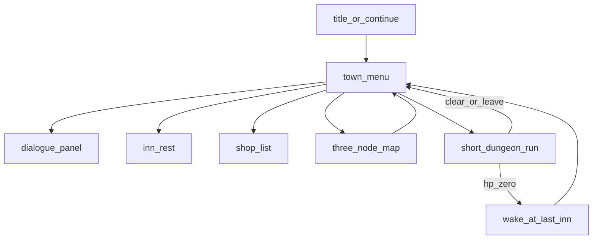

# Pocket Dungeon mini RPG

Work lives in [R1-Apps/dungeon](C:/Users/Home/Desktop/Dev/R1-Apps/dungeon), not this MIDI repo. Same 240×282 Creation, same sprite bake + bump-combat sim, same `creationStorage` persist. The crawler becomes one verb inside a small campaign.

## What we locked

- **Grow** [dungeon/](C:/Users/Home/Desktop/Dev/R1-Apps/dungeon) — do not start a sibling app.
- **Persistent hero.** Death is a setback: wake at the last inn, lose some gold, keep class/flags/gear. No wipe.
- **2–3 towns**, story/quest first. Combat is short named sites, not an 8-floor grind as the default loop.
- **Menu towns** + a **3-node travel map**. Only dungeons stay 7×7 walkable rooms.

## Design (the game)

**Fantasy.** You are one traveler on a broken road between three named places. Talking and choosing where to go is the game. Fighting is a few rooms that prove a story beat.

**World (v1 campaign, authored data, not LLM):**

- **Ashford** — starting village. Inn, shop, elder. Quest: the miller’s cellar has gone quiet.
- **Saltmere** — market town, unlocked after Ashford’s site is cleared. Inn, shop, harbor-master. Quest: a second token in a crypt.
- **Keepgate** — last stop. Inn, one NPC, the old 8-floor ogre hold as the finale (kept as a *named late site*, not the whole game).

Travel is a 3-node map (Ashford — Saltmere — Keepgate). Scroll highlights a node; side click goes there if the flag is set. No walkable overworld.

**Sites (walkable, bump combat, existing sim):**

- `cellar` — 3 rooms, slime/bat, no ogre. Story beat 1.
- `crypt` — 4 rooms, skeleton, small named fight. Story beat 2.
- `hold` — reuse today’s floor graph (5–8 rooms per floor, floors 1–8, ogre on 8). Story beat 3 / ending.

Clearing a site returns you to the town that sent you, with a flag set. You can re-enter a cleared site (weaker or empty) if you want loot; story does not replay.

**Town UI.** Reuse the existing overlay `panel` in [dungeon/index.html](C:/Users/Home/Desktop/Dev/R1-Apps/dungeon/index.html). A town is a title + scrollable list (Talk / Inn / Shop / Road / Pack). Dialogue is the same panel: 1–3 lines of text, 2–3 choices. No walkable plazas.

**Death.** HP ≤ 0 in a site: drop the in-progress site run, set HP to max at `lastInn`, gold = `floor(gold / 2)`, log a journal line (epitaphs become a graveyard/journal, not a game-over). Then mode `town`.

**Class.** Chosen once on a new save (knight / scout / mage kits unchanged). Mage stays “high ATK, no spell menu” until a later slice.

**LLM.** Still garnish only: optional flavor line on site-room enter. All quest text, flags, and travel locks are local authored data. The game is fully playable with no `PluginMessageHandler`.

**Out of scope (whole campaign):** party members, crafting, open-world walking, LLM-authored quests, spell targeting UI, sharing runtime with Familiar, leaving the R1.

## Architecture (so it fits the existing split)

Keep the three-script load order. Add one data/script, do not dump the campaign into [dungeon.js](C:/Users/Home/Desktop/Dev/R1-Apps/dungeon/js/dungeon.js).

- [sprites.js](C:/Users/Home/Desktop/Dev/R1-Apps/dungeon/js/sprites.js) — tiles/actors stay; add a few town/travel glyphs if a menu needs an icon row (optional).
- [dungeon.js](C:/Users/Home/Desktop/Dev/R1-Apps/dungeon/js/dungeon.js) — combat sim only. Extend `createRun` into `createSiteRun(hero, siteId, seed)` so a site can be 3–5 rooms *or* the current 8-floor hold. Hero stats live on a `hero` object; a site run borrows HP/ATK/DEF/gold/pack for the duration and writes them back on exit.
- **New** `js/world.js` — locations, NPC lists, dialogue nodes, quest flags, shop stock, travel edges. Pure data + `advanceDialogue(state, choiceId)`. No canvas, no SDK.
- [app.js](C:/Users/Home/Desktop/Dev/R1-Apps/dungeon/js/app.js) — modes: `title` | `class` | `town` | `talk` | `shop` | `travel` | `play` | `inventory` | `journal`. Persist as today (`creationStorage.plain` Base64 + `localStorage`).

**Snapshot v2** (replace `v: 1` in `applySnapshot`; migrate v1):

- `hero`: classId, hp, maxHp, atk, def, gold, pack, lastInn
- `flags`: string → 0/1 (e.g. `ashford_cellar_clear`)
- `location`: `{ kind: "town"|"travel"|"site", id }`
- `site`: null or current `snapshotRun`
- `meta`: deaths, journal lines (old epitaphs migrate here)

v1 mid-run: resume inside the hold as `siteId: "hold"`, then on death/exit land in Ashford. v1 with no run: new-game into class select.

**Controls (town / talk / travel):** scroll = move highlight; side click = confirm; long press = pack or back; shake unused. Play/inventory/shake-wait stay as they are in a site.

## Build it in three slices

This is too much for one implementation pass. Each slice is a playable game.

**Slice A — RPG chassis (do this first).** Ashford only. Inn rest. Shop (potion/blade/mail for gold). Elder dialogue that unlocks the existing 8-floor dungeon as `hold` entered from town. Death → inn, half gold, keep hero. Snapshot v2. Win ogre → town with a “the road is still closed” line (Saltmere stub). Title copy changes from permadeath to the new pitch. Tests in [dungeon/test/dungeon_test.js](C:/Users/Home/Desktop/Dev/R1-Apps/dungeon/test/dungeon_test.js) for migrate, death-setback, and flag write-back.

**Slice B — Campaign map.** Add Saltmere + Keepgate nodes, `cellar` and `crypt` short sites, lock travel on flags, three authored quest dialogues. Shrink the default Ashford site to `cellar`; move 8-floor `hold` to Keepgate.

**Slice C — Density + ending.** More NPCs per town (still menus), one meaningful branch per town, Keepgate finale text, journal screen, optional LLM flavor on dialogue *after* flags already resolved. Mage stays kit-only unless we explicitly add a pack “cantrip” item.

## Verification

- Browser: 240×282, all new modes, continue after reload, death from a site, shop spend, travel lock.
- Existing sim tests still pass; add snapshot v2 + `world.js` flag tests (node/`dungeon_test.js` pattern).
- R1: storage, `sideClick` debounce, long-press vs pack in town. Flag **untested-on-hardware** until you run the deployed Pages URL.

## After you approve this design

Next step is a written spec in R1-Apps (`docs/superpowers/specs/2026-08-29-pocket-rpg-design.md`) covering Slice A in file-level detail, then an implementation plan for Slice A only. Slices B and C get their own specs when A is shipped.
